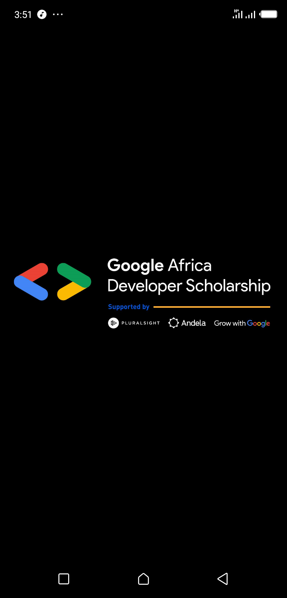

# GADS2020-LEADERBORD-APP-MAIN
Google Africa Developer Scholarship 2020 Learning phase II practice project
<h2>Associate Android Developer Path</h2>
 
<h2>Features2020</h2>

Utilizes <strong>GADS2020</strong> api to list:

 <ul>
  <li>Top learners leaders</li>
  <li>Top Skill IQ leaders</li>
 </ul>
 <h5>The app also allows you to submit the project through network call to a <strong>google form</strong></h5>
<h2>What the project entails</h2>
<ul>
 <li>Multi-Activity</li>
 <li>Viewpager2</li>
 <li>Recyclerview</li>
 <li>Custimizing toolbar</li>
 <li>Working with google forms</li>
 <li>Making Network Request</li>
 <li>Volley library</li>
 <li>Dialogs</li>
</ul>
 
<h2>Screenshots</h2>

 <h3>Splash screen</h3>

 

 <h3>Top Leaners</h3>

<h3>Top Skill IQ</h3>

<h3>Submission Form</h3>

<h3>Confirm Submission</h3>

<h3>Submission Success</h3>

<h3>Submission Error</h3>

